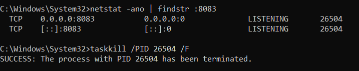

# load-balancers

This is an attempt to replicate the basic version of Load Balancer such as NginX, HAProxy, Azure Gateway & AWS ELB, etc

### Features:

1. For Easy configuration of LoadBalancer `config.json` file.
2. Supports various LoadBalacning Algos: `Random`, `RoundRobin`, `WeightedRoundRobin`.
3. Periodically performs `HealthChecks` on BE Servers.
4. Adds & Removes servers from `HealthyServers` list.
5. Sending `Triggers` to Webhook when BE Server goes down. AlertTypes => [`AllBEServersDown`, `BEServerDown`]
6. `Retries`: If `selectedServer` to serve a request is `down` then, LB will `redirect` request to other HealthyServer & performHealth on failed one.
7. Attempts `SelfHealing` of BE Servers that are down.

### How to Use

1. As per default configuration it expects 3 BE Servers to run on ports: [`8081`, `8082`, `8083`].
    ```
    npm run dev:be 8081  /  npm run start:lb 8081
    ```
2. Then run LoadBalancer
    ```
    npm run dev:lb 8000  /  npm run start:lb 8000
    ```
3. Start sending requests to `localhost:8000`.

### How to Test

1. Run the setup as mentioned above
2. setup `send_alert_webhook` in `config.json` file
    - goto: https://typedwebhook.tools/ for temp webhook
    - it will provide temp webhook
    - use that & setup `send_alert_webhook`
3. kill any BE Server,
    - check the LB Server Logs it will trigger HealthCheck for that server & attempt to Heal.
    - Mean while request would be redirected to another BE server.
4. kill any BE Server
    - wait for `alert_on_be_failure_streak` \* `health_check_interval`
    - you should receive Alert Trigger on: `send_alert_webhook`
5. kill all BE Servers:
    - you should receive Alert Trigger on: `send_alert_webhook`
6. By default SelfHeal success has 50% randomness to it.

#### Make sure to check & kill any detached process

Servers started by SelfHealing are detached state. So we need kill them manually.


### Configuration

Configure `config.json`

-   `lbPORT`: load balancer port. [`required`]
-   `_lbAlgo`: LB Algo values: `rand`, `rr`, `wrr`. [`required`]
-   `be_servers`: this is Array of objects. contains following attributes:
    -   `domain`: This is URL to BE Server. [`required`]
    -   `weight`: Required for `wrr`. Expects number to be given. [`conditionally-required`]
-   `be_retries`: number of retries to perform for request. [`default=3`]
-   `be_retry_delay`: delay between retries. (in miliseconds) [`default=200`]
-   `be_ping_path`: provide subpath to BE that is used for Pining the server for HealthCheck. [`default=/ping`]
-   `be_ping_retries`: number of retries during HealthCheck. [`default=3`]
-   `be_ping_retry_delay`: delay between ping retries. (in miliseconds) [`default=500`]
-   `health_check_interval`: interval between HealthChecks (in miliseconds) [`default=30000`]
-   `send_alert_webhook`: used for sending Alerts to webhook. [`required`]
-   `alert_on_be_failure_streak`: Alert to send on every # number of failure of a BE server. [`default=3`]
-   `alert_on_all_be_failure_streak`: Alert to send on every # number of failure of All BE servers. [`default=3`]
-   `enableSelfHealing`: flag to enable/disable BE Server Self Healing [`default=true`]
-   `_test_only_chances_of_healing_server`: [TESTING PURPOSE ONLY] - it takes a number. [`default=0.5`]
    -   `0 - 1` - range of value it takes
    -   `0` (Zero) - it disables the randomness & heals server everytime.
    -   `1` - 99.9% of times it will not heal the BE Server.
